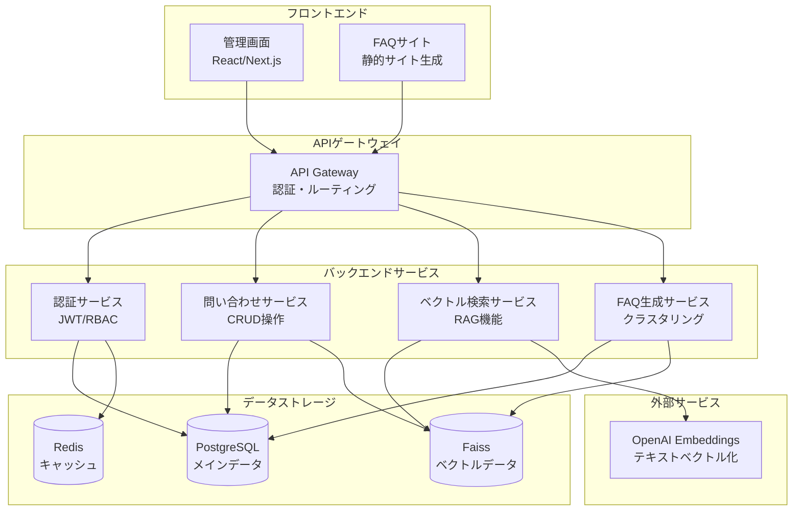
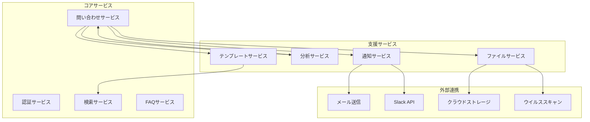

# 設計文書

## 概要

問い合わせ管理システムは、複数のアプリケーションからの問い合わせを統合管理し、RAG機能を活用した効率的なサポート業務を実現するWebアプリケーションです。マイクロサービスアーキテクチャを採用し、スケーラビリティと保守性を確保します。

## アーキテクチャ

### システム全体構成



### 技術スタック

- **フロントエンド**: React 18 + Next.js 14 + TypeScript
- **バックエンド**: NestJS + TypeScript + TypeORM
- **データベース**: PostgreSQL (メイン) + Faiss (ベクトル)
- **キャッシュ**: Redis
- **認証**: JWT + bcrypt + Passport.js
- **API仕様**: OpenAPI 3.0 (Swagger)
- **ベクトル化**: OpenAI Embeddings API
- **検索**: ハイブリッド検索（全文検索 + ベクトル検索）
- **デプロイ**: Docker + Docker Compose

## コンポーネントと インターフェース

### 1. 認証サービス (AuthService)

**責任**: ユーザー認証、認可、権限管理

**主要インターフェース**:
```typescript
interface AuthService {
  // ユーザー管理機能（要件4対応）
  login(credentials: LoginCredentials): Promise<AuthResult>
  validateToken(token: string): Promise<UserContext>
  createUser(userData: CreateUserRequest): Promise<User>
  updateUser(userId: string, updates: UpdateUserRequest): Promise<User>
  getUserHistory(userId: string): Promise<UserHistory[]>
  
  // 権限管理機能（要件5対応）
  checkPermission(userId: string, resource: string, action: string): Promise<boolean>
  assignRole(userId: string, roleId: string): Promise<void>
  createRole(roleData: CreateRoleRequest): Promise<Role>
  updateRole(roleId: string, updates: UpdateRoleRequest): Promise<Role>
  
  // API認証機能（要件7対応）
  validateApiKey(apiKey: string): Promise<ApiKeyContext>
  generateApiKey(appId: string): Promise<string>
  revokeApiKey(apiKey: string): Promise<void>
  checkRateLimit(apiKey: string): Promise<RateLimitStatus>
  
  // セキュリティ機能
  logAuthAttempt(attempt: AuthAttempt): Promise<void>
  detectSuspiciousActivity(userId: string): Promise<SecurityAlert[]>
}

interface LoginCredentials {
  email: string
  password: string
}

interface AuthResult {
  user: User
  accessToken: string
  refreshToken: string
  expiresIn: number
}

interface ApiKeyContext {
  appId: string
  permissions: string[]
  rateLimit: RateLimitConfig
  isActive: boolean
}

interface RateLimitStatus {
  remaining: number
  resetTime: Date
  isExceeded: boolean
}
```

**権限モデル**:
- **管理者**: 全機能アクセス可能
- **サポート担当者**: 問い合わせ対応、FAQ編集
- **閲覧者**: 問い合わせ閲覧のみ
- **API利用者**: API経由での問い合わせ登録のみ

**設計判断の根拠**:
- **ユーザー履歴管理**: 要件4でユーザー情報更新時の変更履歴記録が必要
- **API認証**: 要件7でAPIキーまたはトークンベースの認証が必要
- **レート制限**: 要件7でAPI利用制限の管理が必要
- **セキュリティログ**: 要件4で無効な認証情報でのアクセス試行ログが必要

### 2. 問い合わせサービス (InquiryService)

**責任**: 問い合わせのCRUD操作、状態管理、履歴管理

**主要インターフェース**:
```typescript
interface InquiryService {
  // 基本CRUD操作（要件1対応）
  createInquiry(inquiry: CreateInquiryRequest): Promise<Inquiry>
  getInquiry(id: string): Promise<InquiryDetail>
  updateInquiry(id: string, updates: UpdateInquiryRequest): Promise<Inquiry>
  
  // 検索・フィルタリング機能（要件8対応）
  searchInquiries(criteria: SearchCriteria): Promise<PaginatedResult<Inquiry>>
  filterInquiries(filters: InquiryFilters): Promise<PaginatedResult<Inquiry>>
  
  // 回答管理機能（要件2対応）
  addResponse(inquiryId: string, response: ResponseData): Promise<Response>
  updateResponse(responseId: string, updates: ResponseUpdate): Promise<Response>
  getInquiryHistory(inquiryId: string): Promise<InquiryHistory[]>
  
  // 状態管理（要件2対応）
  updateStatus(inquiryId: string, status: InquiryStatus, userId: string): Promise<void>
  getStatusHistory(inquiryId: string): Promise<StatusHistory[]>
  
  // 自動処理（要件1, 3対応）
  generateInquiryId(): string
  validateInquiryData(inquiry: CreateInquiryRequest): ValidationResult
  notifyInquiryCreated(inquiry: Inquiry): Promise<void>
}

interface CreateInquiryRequest {
  title: string           // 必須項目
  content: string         // 必須項目
  appId: string          // 必須項目（対象アプリ）
  customerEmail?: string
  customerName?: string
  category?: string
  priority?: 'low' | 'medium' | 'high'
}

interface InquiryFilters {
  appId?: string
  status?: InquiryStatus[]
  category?: string[]
  assignedTo?: string
  dateRange?: DateRange
  priority?: string[]
  customerEmail?: string
}

interface SearchCriteria {
  query: string           // 全文検索クエリ
  filters?: InquiryFilters
  sortBy?: string
  sortOrder?: 'asc' | 'desc'
  page?: number
  limit?: number
}
```

**状態管理**:
- **新規**: 登録直後の状態
- **対応中**: サポート担当者が対応開始
- **保留**: 追加情報待ち
- **解決済み**: 対応完了
- **クローズ**: 最終完了状態

**設計判断の根拠**:
- **履歴管理**: 要件2で状態変更履歴と回答更新履歴の保持が必要
- **バリデーション**: 要件1で必須項目チェックとエラーメッセージ返却が必要
- **検索機能**: 要件8で複数条件での検索・フィルタリングとページネーション対応が必要
- **通知機能**: 要件1で登録完了通知が必要

### 3. ハイブリッド検索サービス (SearchService)

**責任**: 全文検索とベクトル検索を組み合わせたハイブリッド検索、RAG機能

**主要インターフェース**:
```typescript
interface SearchService {
  // ベクトル検索
  embedText(text: string): Promise<number[]>
  storeVector(id: string, vector: number[], metadata: VectorMetadata): Promise<void>
  vectorSearch(queryVector: number[], limit: number): Promise<VectorSearchResult[]>
  
  // 全文検索
  fullTextSearch(query: string, filters: SearchFilters): Promise<FullTextSearchResult[]>
  
  // ハイブリッド検索
  hybridSearch(query: string, options: HybridSearchOptions): Promise<HybridSearchResult[]>
  
  // RAG機能
  ragSearch(query: string, context: RAGContext): Promise<RAGResult>
  
  updateVector(id: string, vector: number[], metadata: VectorMetadata): Promise<void>
  deleteVector(id: string): Promise<void>
}

interface HybridSearchOptions {
  vectorWeight: number // 0.0-1.0, ベクトル検索の重み
  textWeight: number   // 0.0-1.0, 全文検索の重み
  limit: number
  filters?: SearchFilters
}

interface HybridSearchResult {
  id: string
  content: string
  vectorScore: number
  textScore: number
  combinedScore: number
  metadata: VectorMetadata
}
```

**ハイブリッド検索戦略**:
- PostgreSQLの全文検索機能（GIN インデックス）とベクトル検索を併用
- スコアの正規化と重み付け平均による統合
- 問い合わせタイトル + 内容を結合してベクトル化
- 回答内容も個別にベクトル化
- メタデータにアプリID、カテゴリ、日付を含める

### 4. FAQ管理サービス (FAQService)

**責任**: FAQ の手動作成・編集、自動生成、サイト更新

**主要インターフェース**:
```typescript
interface FAQService {
  // 手動FAQ管理
  createFAQ(faqData: CreateFAQRequest): Promise<FAQ>
  updateFAQ(faqId: string, updates: UpdateFAQRequest): Promise<FAQ>
  deleteFAQ(faqId: string): Promise<void>
  getFAQsByApp(appId: string, filters?: FAQFilters): Promise<FAQ[]>
  
  // 自動FAQ生成
  generateFAQ(appId: string, options: FAQGenerationOptions): Promise<FAQ[]>
  previewGeneratedFAQ(appId: string, options: FAQGenerationOptions): Promise<FAQ[]>
  
  // FAQ公開管理
  publishFAQ(faqId: string): Promise<void>
  unpublishFAQ(faqId: string): Promise<void>
  publishFAQSite(appId: string): Promise<string>
  
  // FAQ分析
  getFAQAnalytics(appId: string): Promise<FAQAnalytics>
}

interface CreateFAQRequest {
  appId: string
  question: string
  answer: string
  category?: string
  tags?: string[]
  isPublished?: boolean
}

interface FAQGenerationOptions {
  minClusterSize: number
  maxClusters: number
  similarityThreshold: number
  dateRange?: DateRange
  categories?: string[]
}
```

**FAQ機能の特徴**:
- **手動作成**: 管理画面からのFAQ作成・編集機能
- **自動生成**: 問い合わせクラスタリングによる自動FAQ生成
- **プレビュー機能**: 自動生成前の内容確認
- **公開管理**: FAQ単位での公開/非公開制御
- **分析機能**: FAQ利用状況の分析

**FAQ自動生成アルゴリズム**:
1. アプリごとの問い合わせをベクトル検索で類似度計算
2. K-meansクラスタリングで類似問い合わせをグループ化
3. 各クラスタから代表的な問い合わせと回答を選出
4. 自然言語処理でFAQ形式に整形
5. 管理者による確認・編集後に公開

**設計判断の根拠**:
- **クラスタリング**: 要件6で類似する問い合わせをグループ化してFAQ項目を作成する必要
- **アプリ別FAQ**: 要件6で各アプリ専用のFAQページを提供する必要
- **自動反映**: 要件6でFAQ内容更新時の自動反映が必要

## API設計

### RESTful API仕様（要件7対応）

**認証方式**:
- **APIキー認証**: `X-API-Key` ヘッダーでAPIキーを送信
- **JWT認証**: `Authorization: Bearer <token>` ヘッダーでJWTトークンを送信

**主要エンドポイント**:

```typescript
// 問い合わせ登録API
POST /api/v1/inquiries
Headers: {
  "X-API-Key": "your-api-key",
  "Content-Type": "application/json"
}
Body: {
  "title": "問い合わせタイトル",
  "content": "問い合わせ内容",
  "appId": "app-uuid",
  "customerEmail": "customer@example.com",
  "customerName": "顧客名",
  "category": "技術的問題",
  "priority": "medium"
}
Response: {
  "success": true,
  "data": {
    "id": "inquiry-uuid",
    "title": "問い合わせタイトル",
    "status": "new",
    "createdAt": "2024-01-01T00:00:00Z"
  }
}

// 問い合わせ検索API
GET /api/v1/inquiries?query=検索語&appId=app-uuid&page=1&limit=20
Headers: {
  "Authorization": "Bearer jwt-token"
}
Response: {
  "success": true,
  "data": {
    "items": [...],
    "total": 100,
    "page": 1,
    "limit": 20,
    "totalPages": 5
  }
}

// FAQ取得API
GET /api/v1/faqs/{appId}
Response: {
  "success": true,
  "data": [
    {
      "id": "faq-uuid",
      "question": "よくある質問",
      "answer": "回答内容",
      "category": "カテゴリ",
      "updatedAt": "2024-01-01T00:00:00Z"
    }
  ]
}
```

**エラーレスポンス形式**:
```typescript
{
  "success": false,
  "error": {
    "code": "VALIDATION_ERROR",
    "message": "入力データに不備があります",
    "details": [
      {
        "field": "title",
        "message": "タイトルは必須項目です"
      }
    ]
  }
}
```

**レート制限**:
- APIキーごとに1時間あたり1000リクエスト
- 制限超過時は429 Too Many Requestsを返却
- レスポンスヘッダーで残り回数を通知

**設計判断の根拠**:
- **標準HTTPステータス**: 要件7で標準的なHTTPステータスコードとJSON形式でのレスポンス返却が必要
- **レート制限**: 要件7でAPI利用制限を超過した場合のレート制限エラー返却が必要
- **認証方式**: 要件7でAPIキーまたはトークンベースの認証提供が必要

## データモデル

### メインデータベース (PostgreSQL)

```sql
-- ユーザーテーブル
CREATE TABLE users (
    id UUID PRIMARY KEY DEFAULT gen_random_uuid(),
    email VARCHAR(255) UNIQUE NOT NULL,
    password_hash VARCHAR(255) NOT NULL,
    name VARCHAR(255) NOT NULL,
    role_id UUID REFERENCES roles(id),
    created_at TIMESTAMP DEFAULT CURRENT_TIMESTAMP,
    updated_at TIMESTAMP DEFAULT CURRENT_TIMESTAMP
);

-- 役割テーブル
CREATE TABLE roles (
    id UUID PRIMARY KEY DEFAULT gen_random_uuid(),
    name VARCHAR(100) UNIQUE NOT NULL,
    permissions JSONB NOT NULL,
    created_at TIMESTAMP DEFAULT CURRENT_TIMESTAMP
);

-- アプリケーションテーブル
CREATE TABLE applications (
    id UUID PRIMARY KEY DEFAULT gen_random_uuid(),
    name VARCHAR(255) NOT NULL,
    description TEXT,
    api_key VARCHAR(255) UNIQUE,
    created_at TIMESTAMP DEFAULT CURRENT_TIMESTAMP
);

-- 問い合わせテーブル
CREATE TABLE inquiries (
    id UUID PRIMARY KEY DEFAULT gen_random_uuid(),
    app_id UUID REFERENCES applications(id),
    title VARCHAR(500) NOT NULL,
    content TEXT NOT NULL,
    status VARCHAR(50) DEFAULT 'new',
    priority VARCHAR(20) DEFAULT 'medium',
    category VARCHAR(100),
    customer_email VARCHAR(255),
    customer_name VARCHAR(255),
    assigned_to UUID REFERENCES users(id),
    created_at TIMESTAMP DEFAULT CURRENT_TIMESTAMP,
    updated_at TIMESTAMP DEFAULT CURRENT_TIMESTAMP
);

-- 回答テーブル
CREATE TABLE responses (
    id UUID PRIMARY KEY DEFAULT gen_random_uuid(),
    inquiry_id UUID REFERENCES inquiries(id),
    user_id UUID REFERENCES users(id),
    content TEXT NOT NULL,
    is_public BOOLEAN DEFAULT false,
    created_at TIMESTAMP DEFAULT CURRENT_TIMESTAMP
);

-- FAQテーブル
CREATE TABLE faqs (
    id UUID PRIMARY KEY DEFAULT gen_random_uuid(),
    app_id UUID REFERENCES applications(id),
    question TEXT NOT NULL,
    answer TEXT NOT NULL,
    category VARCHAR(100),
    order_index INTEGER DEFAULT 0,
    is_published BOOLEAN DEFAULT false,
    created_at TIMESTAMP DEFAULT CURRENT_TIMESTAMP,
    updated_at TIMESTAMP DEFAULT CURRENT_TIMESTAMP
);

-- ユーザー履歴テーブル（要件4対応）
CREATE TABLE user_history (
    id UUID PRIMARY KEY DEFAULT gen_random_uuid(),
    user_id UUID REFERENCES users(id),
    field_name VARCHAR(100) NOT NULL,
    old_value TEXT,
    new_value TEXT,
    changed_by UUID REFERENCES users(id),
    changed_at TIMESTAMP DEFAULT CURRENT_TIMESTAMP
);

-- 問い合わせ状態履歴テーブル（要件2対応）
CREATE TABLE inquiry_status_history (
    id UUID PRIMARY KEY DEFAULT gen_random_uuid(),
    inquiry_id UUID REFERENCES inquiries(id),
    old_status VARCHAR(50),
    new_status VARCHAR(50) NOT NULL,
    changed_by UUID REFERENCES users(id),
    comment TEXT,
    changed_at TIMESTAMP DEFAULT CURRENT_TIMESTAMP
);

-- 回答履歴テーブル（要件2対応）
CREATE TABLE response_history (
    id UUID PRIMARY KEY DEFAULT gen_random_uuid(),
    response_id UUID REFERENCES responses(id),
    old_content TEXT,
    new_content TEXT NOT NULL,
    changed_by UUID REFERENCES users(id),
    changed_at TIMESTAMP DEFAULT CURRENT_TIMESTAMP
);

-- 認証試行ログテーブル（要件4対応）
CREATE TABLE auth_attempts (
    id UUID PRIMARY KEY DEFAULT gen_random_uuid(),
    email VARCHAR(255),
    ip_address INET,
    user_agent TEXT,
    success BOOLEAN NOT NULL,
    failure_reason VARCHAR(255),
    attempted_at TIMESTAMP DEFAULT CURRENT_TIMESTAMP
);

-- APIキー管理テーブル（要件7対応）
CREATE TABLE api_keys (
    id UUID PRIMARY KEY DEFAULT gen_random_uuid(),
    app_id UUID REFERENCES applications(id),
    key_hash VARCHAR(255) UNIQUE NOT NULL,
    name VARCHAR(255),
    permissions JSONB DEFAULT '[]',
    rate_limit_per_hour INTEGER DEFAULT 1000,
    is_active BOOLEAN DEFAULT true,
    last_used_at TIMESTAMP,
    created_at TIMESTAMP DEFAULT CURRENT_TIMESTAMP,
    expires_at TIMESTAMP
);

-- レート制限追跡テーブル（要件7対応）
CREATE TABLE rate_limit_tracking (
    id UUID PRIMARY KEY DEFAULT gen_random_uuid(),
    api_key_id UUID REFERENCES api_keys(id),
    request_count INTEGER DEFAULT 0,
    window_start TIMESTAMP NOT NULL,
    window_end TIMESTAMP NOT NULL,
    created_at TIMESTAMP DEFAULT CURRENT_TIMESTAMP
);
```

### ベクトルデータベース (Faiss)

```typescript
interface VectorMetadata {
  id: string
  type: 'inquiry' | 'response' | 'faq'
  appId: string
  category?: string
  status?: string
  createdAt: string
  title?: string
}

interface FaissIndexConfig {
  dimension: number        // ベクトル次元数（OpenAI Embeddings: 1536）
  indexType: 'IndexFlatIP' | 'IndexIVFFlat' | 'IndexHNSWFlat'
  metricType: 'METRIC_INNER_PRODUCT' | 'METRIC_L2'
  nlist?: number          // IVFインデックス用のクラスタ数
  nprobe?: number         // 検索時のクラスタ数
}
```

**Faiss設計の特徴**:
- **ローカル実行**: 外部サービス依存なしでベクトル検索を実行
- **高速検索**: CPUとGPU両対応で高速な類似度検索
- **インデックス永続化**: ファイルシステムへのインデックス保存
- **スケーラブル**: 大量ベクトルデータの効率的な管理
- **メタデータ管理**: PostgreSQLでベクトルIDとメタデータを関連付け

## エラーハンドリング

### エラー分類と対応

1. **認証エラー**
   - 401 Unauthorized: 無効なトークン
   - 403 Forbidden: 権限不足
   - 対応: エラーログ記録、適切なエラーメッセージ返却

2. **バリデーションエラー**
   - 400 Bad Request: 入力データ不正
   - 対応: 詳細なバリデーションメッセージ返却

3. **外部サービスエラー**
   - ベクトル化API障害: フォールバック処理
   - データベース接続エラー: リトライ機構

4. **システムエラー**
   - 500 Internal Server Error: 予期しないエラー
   - 対応: エラーログ記録、管理者通知

### エラーログ戦略

```typescript
interface ErrorLog {
  timestamp: string
  level: 'error' | 'warn' | 'info'
  service: string
  message: string
  stack?: string
  userId?: string
  requestId: string
  metadata?: Record<string, any>
}
```

## テスト戦略

### テストピラミッド

1. **ユニットテスト** (70%)
   - 各サービスの個別機能テスト
   - Jest + TypeScript
   - カバレッジ目標: 90%以上

2. **統合テスト** (20%)
   - サービス間連携テスト
   - データベース接続テスト
   - 外部API連携テスト

3. **E2Eテスト** (10%)
   - ユーザーシナリオテスト
   - Playwright使用
   - 主要フローの自動テスト

### テストデータ管理

- テスト用データベースの自動セットアップ
- ファクトリーパターンでテストデータ生成
- テスト実行後のデータクリーンアップ

### CI/CDパイプライン

```yaml
# GitHub Actions例
name: CI/CD Pipeline
on: [push, pull_request]
jobs:
  test:
    runs-on: ubuntu-latest
    steps:
      - name: Run Unit Tests
      - name: Run Integration Tests
      - name: Run E2E Tests
      - name: Generate Coverage Report
  
  deploy:
    needs: test
    if: github.ref == 'refs/heads/main'
    steps:
      - name: Build Docker Images
      - name: Deploy to Staging
      - name: Run Smoke Tests
      - name: Deploy to Production
```

## セキュリティ考慮事項

### 認証・認可
- JWT トークンの適切な有効期限設定
- リフレッシュトークンによる自動更新
- RBAC による細かい権限制御

### データ保護
- パスワードのbcryptハッシュ化
- 機密データの暗号化保存
- APIキーの安全な管理

### API セキュリティ
- レート制限の実装
- CORS設定の適切な管理
- 入力値のサニタイゼーション

### インフラセキュリティ
- HTTPS通信の強制
- データベース接続の暗号化
- 環境変数による設定管理

## パフォーマンス最適化

### データベース最適化
- 適切なインデックス設計
- クエリの最適化
- 接続プールの設定

### キャッシュ戦略
- Redis による頻繁アクセスデータのキャッシュ
- FAQ データのキャッシュ
- ベクトル検索結果のキャッシュ

### スケーラビリティ
- 水平スケーリング対応
- ロードバランサーの設置
- マイクロサービス間の非同期通信

### 5. 通知・アラートサービス (NotificationService)

**責任**: 重要な問い合わせや状態変更の関係者への通知

**主要インターフェース**:
```typescript
interface NotificationService {
  // 通知送信機能
  sendNotification(notification: NotificationRequest): Promise<void>
  sendBulkNotifications(notifications: NotificationRequest[]): Promise<void>
  
  // 通知設定管理
  createNotificationRule(rule: NotificationRule): Promise<NotificationRule>
  updateNotificationRule(ruleId: string, updates: NotificationRuleUpdate): Promise<NotificationRule>
  getUserNotificationSettings(userId: string): Promise<NotificationSettings>
  updateUserNotificationSettings(userId: string, settings: NotificationSettings): Promise<void>
  
  // アラート機能
  createAlert(alert: AlertRequest): Promise<Alert>
  checkSLAViolations(): Promise<SLAViolation[]>
  escalateInquiry(inquiryId: string, reason: string): Promise<void>
}

interface NotificationRequest {
  type: 'email' | 'slack' | 'teams' | 'webhook'
  recipients: string[]
  subject: string
  content: string
  priority: 'low' | 'medium' | 'high' | 'urgent'
  metadata?: Record<string, any>
}

interface NotificationRule {
  id: string
  name: string
  trigger: 'inquiry_created' | 'status_changed' | 'sla_violation' | 'escalation'
  conditions: NotificationCondition[]
  actions: NotificationAction[]
  isActive: boolean
}
```

**通知機能の特徴**:
- **リアルタイム通知**: 新規問い合わせ、状態変更の即座通知
- **多チャネル対応**: メール、Slack、Teams、Webhook連携
- **カスタマイズ可能**: ユーザー別通知設定
- **SLA監視**: 対応時間超過の自動アラート
- **エスカレーション**: 重要度に応じた自動エスカレーション

### 6. ダッシュボード・分析サービス (AnalyticsService)

**責任**: 問い合わせ状況の可視化と業務改善のためのインサイト提供

**主要インターフェース**:
```typescript
interface AnalyticsService {
  // 基本統計
  getInquiryStatistics(filters: AnalyticsFilters): Promise<InquiryStatistics>
  getResponseTimeAnalytics(filters: AnalyticsFilters): Promise<ResponseTimeAnalytics>
  
  // パフォーマンス分析
  getUserPerformance(userId: string, period: DateRange): Promise<UserPerformance>
  getTeamPerformance(teamId: string, period: DateRange): Promise<TeamPerformance>
  
  // トレンド分析
  getTrendAnalysis(metric: string, period: DateRange): Promise<TrendData[]>
  getPredictiveAnalysis(metric: string): Promise<PredictionData>
  
  // SLA分析
  getSLACompliance(filters: AnalyticsFilters): Promise<SLAComplianceReport>
  
  // カスタムレポート
  generateReport(reportConfig: ReportConfig): Promise<Report>
  scheduleReport(reportConfig: ReportConfig, schedule: ReportSchedule): Promise<ScheduledReport>
}

interface InquiryStatistics {
  totalInquiries: number
  newInquiries: number
  resolvedInquiries: number
  averageResponseTime: number
  satisfactionScore: number
  categoryBreakdown: CategoryStats[]
  appBreakdown: AppStats[]
}
```

**ダッシュボード機能の特徴**:
- **リアルタイム統計**: 問い合わせ件数、対応時間の可視化
- **パフォーマンス分析**: 担当者・チーム別の効率性測定
- **予測分析**: 機械学習による問い合わせ量予測
- **カスタムレポート**: 定期レポートの自動生成
- **SLA監視**: 達成率とボトルネックの特定

### 7. テンプレート管理サービス (TemplateService)

**責任**: 回答テンプレートの管理と効率的な回答支援

**主要インターフェース**:
```typescript
interface TemplateService {
  // テンプレート管理
  createTemplate(template: CreateTemplateRequest): Promise<Template>
  updateTemplate(templateId: string, updates: TemplateUpdate): Promise<Template>
  deleteTemplate(templateId: string): Promise<void>
  getTemplatesByCategory(category: string): Promise<Template[]>
  
  // テンプレート提案
  suggestTemplates(inquiryContent: string): Promise<TemplateSuggestion[]>
  getPopularTemplates(userId: string): Promise<Template[]>
  
  // マクロ機能
  createMacro(macro: CreateMacroRequest): Promise<Macro>
  expandMacro(macroId: string, variables: Record<string, string>): Promise<string>
  
  // 使用統計
  getTemplateUsageStats(templateId: string): Promise<TemplateUsageStats>
  getTeamTemplateStats(teamId: string): Promise<TeamTemplateStats>
}

interface Template {
  id: string
  name: string
  category: string
  content: string
  variables: TemplateVariable[]
  tags: string[]
  isShared: boolean
  usageCount: number
  createdBy: string
  createdAt: Date
}
```

**テンプレート機能の特徴**:
- **AI提案**: 問い合わせ内容に基づく適切なテンプレート提案
- **変数置換**: 動的な内容生成のための変数システム
- **チーム共有**: 組織全体でのベストプラクティス共有
- **使用統計**: 効果的なテンプレートの特定
- **カテゴリ管理**: 問い合わせ種別に応じた分類

### 8. ファイル管理サービス (FileService)

**責任**: 問い合わせに関連するファイルや画像の安全な管理

**主要インターフェース**:
```typescript
interface FileService {
  // ファイルアップロード
  uploadFile(file: FileUploadRequest): Promise<FileMetadata>
  uploadMultipleFiles(files: FileUploadRequest[]): Promise<FileMetadata[]>
  
  // ファイル管理
  getFile(fileId: string): Promise<FileData>
  deleteFile(fileId: string): Promise<void>
  getFilesByInquiry(inquiryId: string): Promise<FileMetadata[]>
  
  // セキュリティ機能
  scanFileForVirus(fileId: string): Promise<ScanResult>
  validateFileType(file: FileUploadRequest): Promise<ValidationResult>
  
  // ストレージ管理
  getStorageUsage(appId: string): Promise<StorageUsage>
  cleanupExpiredFiles(): Promise<CleanupResult>
}

interface FileUploadRequest {
  filename: string
  content: Buffer
  mimeType: string
  inquiryId: string
  uploadedBy: string
}

interface FileMetadata {
  id: string
  filename: string
  size: number
  mimeType: string
  inquiryId: string
  uploadedBy: string
  uploadedAt: Date
  isScanned: boolean
  scanResult?: 'clean' | 'infected' | 'suspicious'
}
```

**ファイル管理機能の特徴**:
- **セキュリティスキャン**: アップロード時の自動ウイルススキャン
- **形式制限**: 許可されたファイル形式のみ受付
- **容量管理**: アプリ別ストレージ使用量監視
- **自動クリーンアップ**: 期限切れファイルの自動削除
- **アクセス制御**: 権限に基づくファイルアクセス管理

## 統合システム設計

### システム間連携



### イベント駆動アーキテクチャ

**主要イベント**:
- `InquiryCreated`: 新規問い合わせ登録時
- `InquiryStatusChanged`: 状態変更時
- `ResponseAdded`: 回答追加時
- `SLAViolationDetected`: SLA違反検知時
- `FileUploaded`: ファイルアップロード時

**イベント処理フロー**:
```typescript
// 問い合わせ作成時のイベント処理例
async function handleInquiryCreated(event: InquiryCreatedEvent) {
  // 1. ベクトル化してベクトルDBに保存
  await vectorService.storeInquiryVector(event.inquiry)
  
  // 2. 自動分類の実行
  const category = await classificationService.classifyInquiry(event.inquiry)
  await inquiryService.updateCategory(event.inquiry.id, category)
  
  // 3. 担当者の自動アサイン
  const assignee = await routingService.findBestAssignee(event.inquiry)
  await inquiryService.assignInquiry(event.inquiry.id, assignee.id)
  
  // 4. 通知の送信
  await notificationService.sendInquiryCreatedNotification(event.inquiry, assignee)
  
  // 5. テンプレート提案の準備
  await templateService.prepareTemplateSuggestions(event.inquiry.id)
}
```

## 将来拡張機能

### フェーズ2: 高度な機能
- **多言語対応**: 自動翻訳とローカライゼーション
- **顧客ポータル**: セルフサービス機能
- **チャットボット**: 初期対応の自動化
- **音声認識**: 電話問い合わせの自動テキスト化

### フェーズ3: AI強化機能
- **感情分析**: 顧客満足度の自動測定
- **予測分析**: 問い合わせ量とリソース需要の予測
- **自動回答生成**: RAGを活用した回答案の自動生成
- **品質スコアリング**: 回答品質の自動評価

この統合設計により、問い合わせ管理システムは単なるCRUDシステムを超えて、効率的なサポート業務を実現する包括的なプラットフォームとなります。